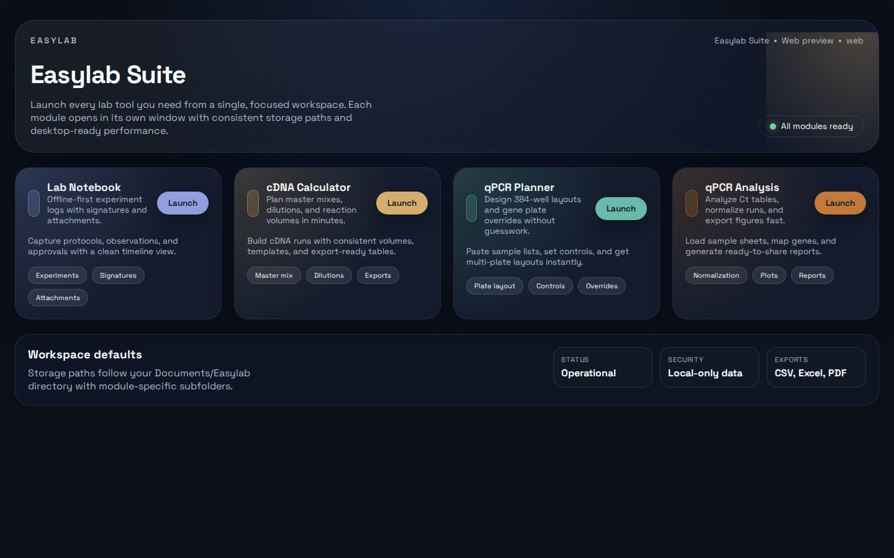
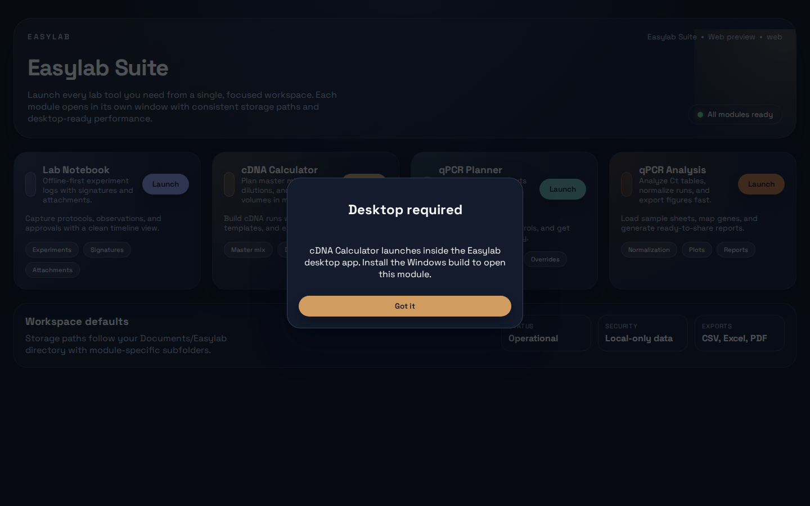

# Easylab Suite

Unified launcher for Easylab Lab Notebook, cDNA Calculator, qPCR Planner, qPCR Analysis, and animal workflow tools.

## Modules
- Lab Notebook
- cDNA Calculator
- qPCR Planner
- qPCR Analysis
- Animal Pairing
- Breeding Pair Selector
- Y-Maze Randomizer

## Requirements
- Node.js 20+ (build/development)
- For a fully offline Windows installer: bundle a portable Python runtime (recommended)
- If you do not bundle the runtime: the target machine must have Python 3.10+ installed (for FastAPI backends + Streamlit)

## Desktop Installer (Windows)
1. Sync module builds (copies assets + backends into `apps/`).
2. (Recommended) Prepare the bundled Python runtime for fully offline installs.
3. Build the Electron installer.

```bash
npm install
npm --prefix web install
npm run build:electron
```

The installer will be generated at `desktop/dist/Easylab Suite Setup 0.1.2.exe`.

### Fully Offline Python Runtime (Recommended)
Run the PowerShell helper on the Windows build machine:
```powershell
.\desktop\scripts\prepare-python-runtime.ps1
```
This generates `desktop/runtime/python/` which is packaged into the installer.

### App Sources
The suite expects the source apps to live next to this repo:
```
/mnt/e/coding projects/
  lab note taking app
  cDNA-calculations-app
  qpcr-calculations-app-git
  qPCR-analysis-app
  Experiment-pairing-app
  Mice-breeding-pair-selector
  Y-maze-randomizer
```
Override with environment variables if needed:
- `EASYLAB_APPS_ROOT`
- `EASYLAB_LABNOTE_PATH`
- `EASYLAB_CDNA_PATH`
- `EASYLAB_QPCR_PLANNER_PATH`
- `EASYLAB_QPCR_ANALYSIS_PATH`
- `EASYLAB_ANIMAL_PAIRING_PATH`
- `EASYLAB_BREEDING_PATH`
- `EASYLAB_YMAZE_PATH`

## Development
```bash
npm --prefix web install
npm run dev
```

## Screenshots


