# Easylab Suite

Easylab Suite is a local-first Windows desktop launcher for the Easylab lab workflow apps. It packages Lab Notebook, reagent calculators, qPCR/ELISA tools, animal workflow helpers, and local phone-message intake into one Electron app.

The suite is designed for laptop use: notebook data, attachments, module outputs, generated exports, and Telegram/WhatsApp intake captures stay on the machine unless the user deliberately points storage at a sync folder.

The current visual system uses a warm local lab-operations style: IBM Plex Sans/Mono typography, a paper-toned grid background, deep evergreen navigation, compact badges, table-first surfaces, and module-specific pictogram icons.

## Screenshots

<table>
  <tr>
    <td width="72%">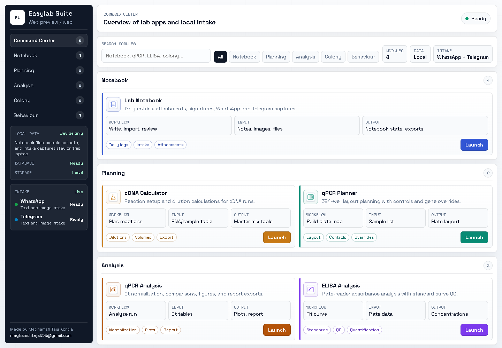</td>
    <td width="28%">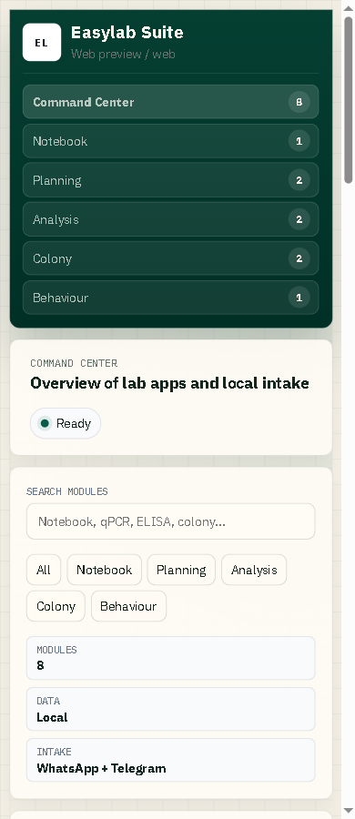</td>
  </tr>
</table>

## Modules

| Module | What it does | Runtime |
| --- | --- | --- |
| Lab Notebook | Daily experiment notes, rich text blocks, project/experiment tags, attachments, exports, signatures, mobile pairing, WhatsApp intake, and Telegram intake. | Static web app |
| cDNA Calculator | RNA/sample dilution and cDNA reaction planning with master-mix output. | Vite + FastAPI |
| qPCR Planner | 384-well qPCR plate layout planning with controls and gene/sample overrides. | Vite + FastAPI |
| qPCR Analysis | Ct import, replicate review, normalization, plots, standards, and report/export workflow. | Streamlit |
| ELISA Analysis | Plate-reader absorbance import, standard curve fitting, QC, and concentration output. | Vite static app |
| Animal Pairing | Cohort balancing and animal pairing from colony/sample sheets. | Vite + FastAPI |
| Breeding Pair Selector | Breeder matching from gene targets and probability thresholds. | Vite + FastAPI |
| Y-Maze Randomizer | Balanced learning/reversal schedules and exit-arm assignments. | Vite + FastAPI |

## Lab Notebook

Lab Notebook is the main capture surface. It supports date-based entries, project and experiment tagging, rich editor blocks, optional per-entry workbooks, attachments, exports, storage setup, local disk sync, mobile pairing, and local message intake.

<details>
<summary>Lab Notebook screenshots</summary>

<table>
  <tr>
    <td>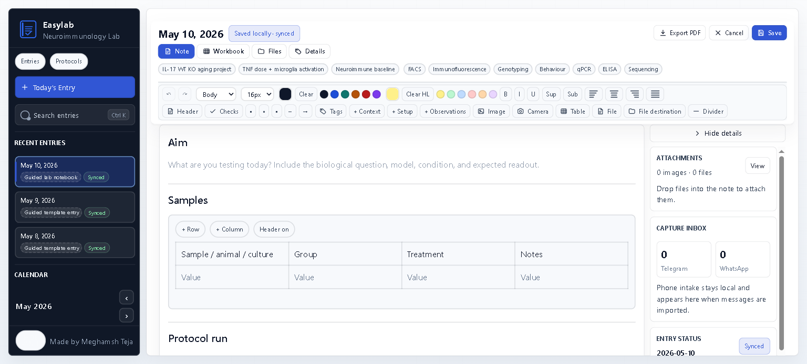<br><strong>Workspace</strong></td>
    <td>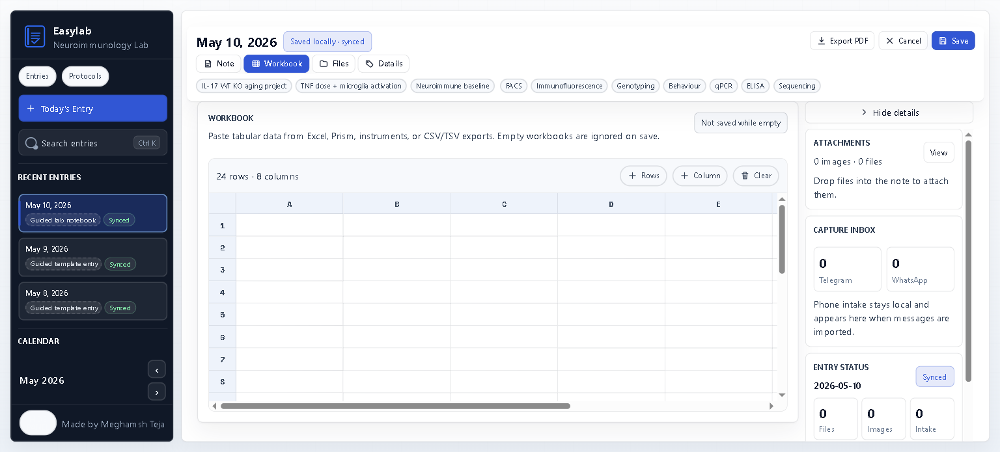<br><strong>Optional workbook</strong></td>
  </tr>
  <tr>
    <td>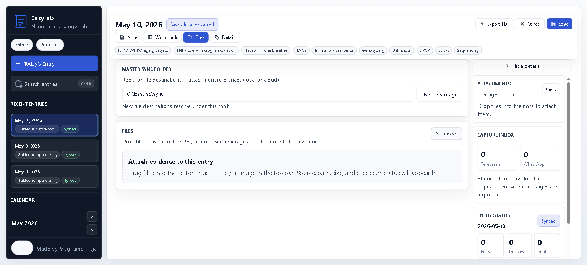<br><strong>Files and details</strong></td>
    <td>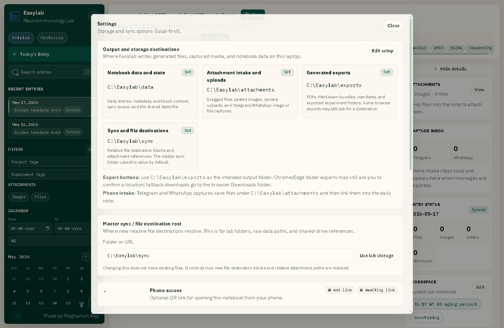<br><strong>Settings and sync</strong></td>
  </tr>
</table>

</details>

## Module Screenshots

Each module opens from the Suite launcher and keeps its own workflow intact while sharing the refreshed Easylab visual system.

<table>
  <tr>
    <td><br><strong>Lab Notebook</strong><br>Daily notes, workbooks, attachments, phone intake.</td>
    <td>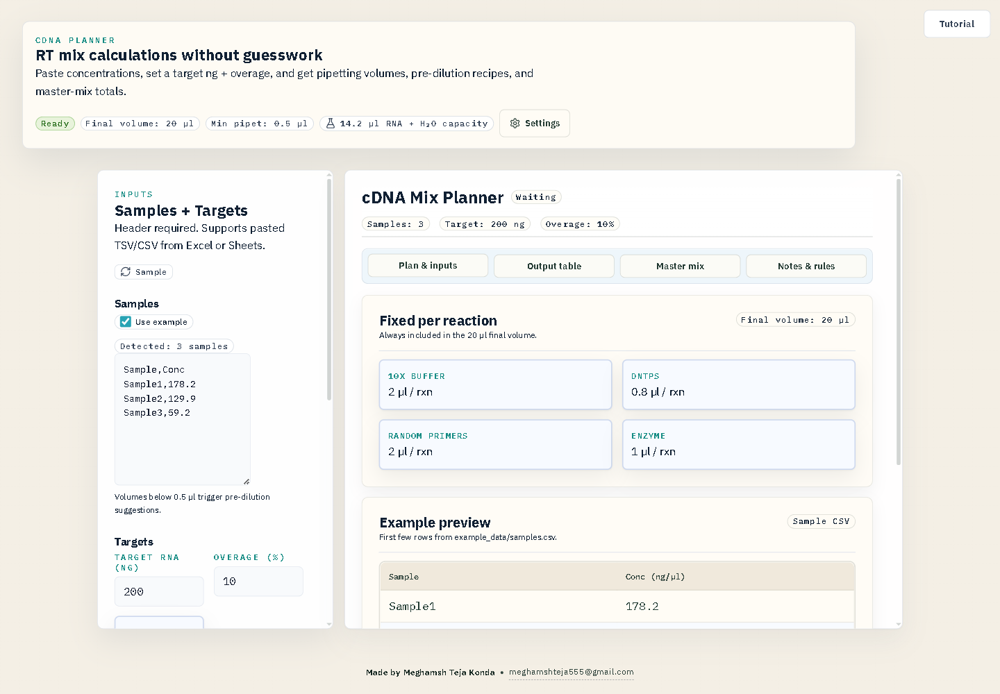<br><strong>cDNA Calculator</strong><br>RNA inputs, dilution planning, master mix.</td>
    <td>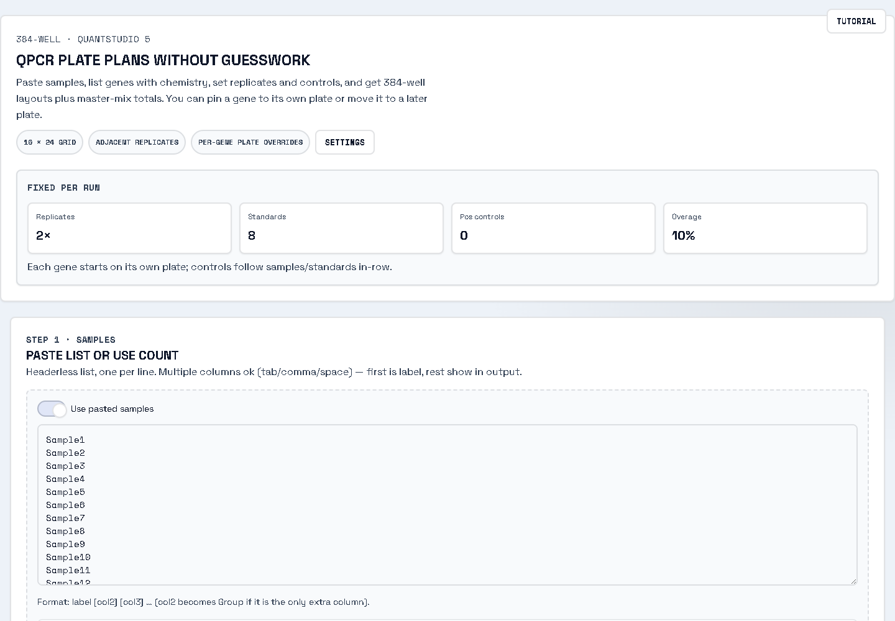<br><strong>qPCR Planner</strong><br>384-well layouts, controls, gene overrides.</td>
    <td>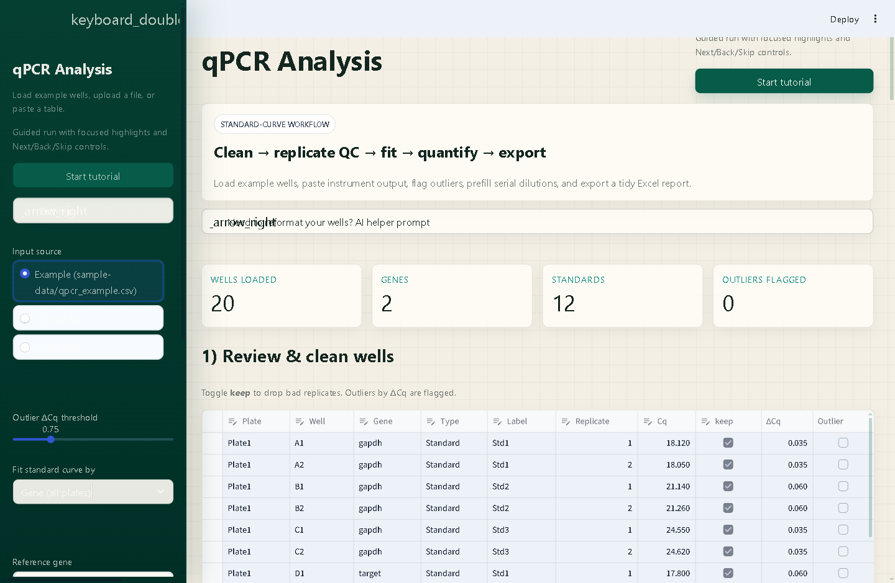<br><strong>qPCR Analysis</strong><br>Ct import, normalization, reports, exports.</td>
  </tr>
  <tr>
    <td>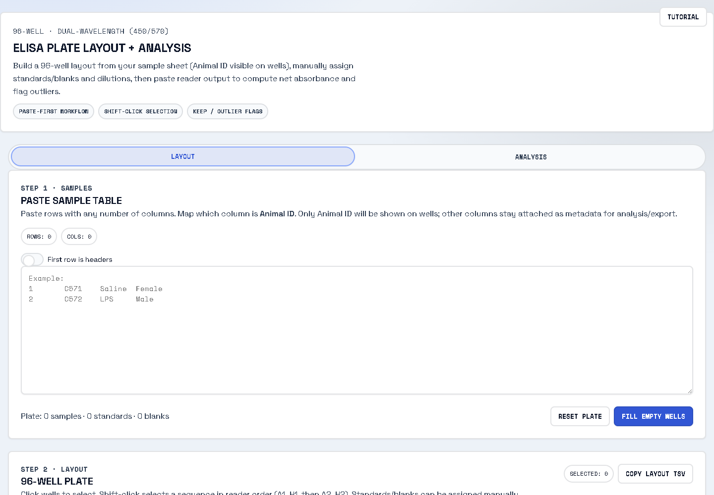<br><strong>ELISA Analysis</strong><br>Plate-reader import, curves, QC, outputs.</td>
    <td>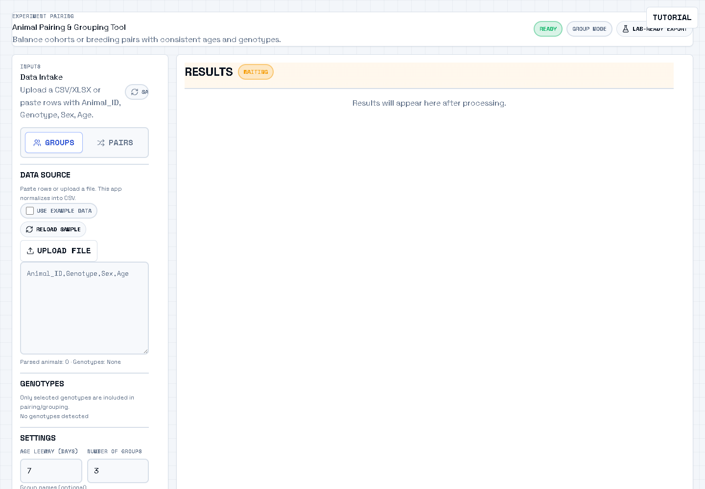<br><strong>Animal Pairing</strong><br>Cohort balancing, genotype filters, exports.</td>
    <td>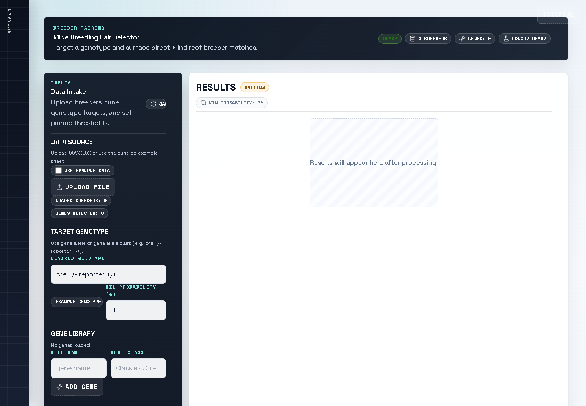<br><strong>Breeding Pair Selector</strong><br>Gene targets, probabilities, pair lists.</td>
    <td>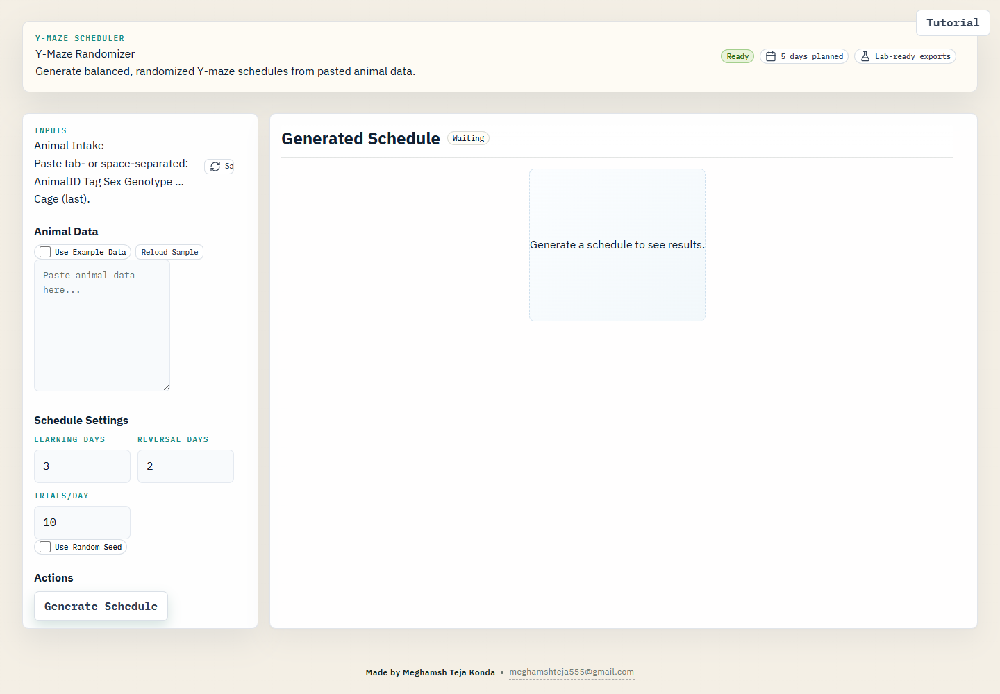<br><strong>Y-Maze Randomizer</strong><br>Balanced schedules and exit-arm exports.</td>
  </tr>
</table>

## Local Phone Intake

The suite can run hidden local receivers that write phone messages into Lab Notebook. These modes are laptop-only and do not provide a paid cloud queue.

### Telegram Intake

Telegram is the simpler local intake path. It uses a bot token and polling, so no public webhook URL is needed.

1. Create a bot with [BotFather](https://t.me/BotFather).
2. Send a test message to the bot.
3. Open `https://api.telegram.org/bot<bot-token>/getUpdates` in a browser and copy `message.chat.id` from the JSON response.
4. Copy [`desktop/scripts/telegram-intake-config.example.json`](desktop/scripts/telegram-intake-config.example.json) to:
   ```text
   %USERPROFILE%\Documents\Easylab\Lab Notebook\data\telegram-intake-config.json
   ```
5. Fill in `botToken` and `allowedChatIds`. Keep this real config file local; do not commit it.
6. Start the local poller:
   ```powershell
   & "$env:LOCALAPPDATA\Programs\Easylab Suite\Easylab Suite.exe" --labnote-telegram-intake
   ```
7. Install the Windows login startup task:
   ```powershell
   powershell -ExecutionPolicy Bypass -File .\desktop\scripts\install-telegram-intake-startup.ps1
   ```

Limitation: Telegram Bot API polling does not send delete events to the bot, so deleting a Telegram message does not remove an already imported Lab Notebook block.

### WhatsApp Intake

WhatsApp intake uses WhatsApp Cloud API webhooks exposed through Tailscale Funnel to a local receiver.

1. Copy `desktop/scripts/whatsapp-intake-config.example.json` to:
   ```text
   %USERPROFILE%\Documents\Easylab\Lab Notebook\data\whatsapp-intake-config.json
   ```
2. Fill in:
   - `verifyToken`: the token also entered in Meta's webhook settings.
   - `accessToken`: WhatsApp Cloud API access token used to download images.
   - `appSecret`: Meta app secret for `X-Hub-Signature-256` validation.
   - `allowedSenders`: WhatsApp sender phone numbers allowed to create notes, digits only.
3. Start the local receiver:
   ```powershell
   & "$env:LOCALAPPDATA\Programs\Easylab Suite\Easylab Suite.exe" --labnote-whatsapp-intake
   ```
4. Expose only the receiver through Tailscale Funnel:
   ```powershell
   tailscale funnel --https=443 localhost:8787
   ```
5. Use the Funnel URL plus `/whatsapp/webhook` as the Meta callback URL.
6. Install the Windows login startup task:
   ```powershell
   powershell -ExecutionPolicy Bypass -File .\desktop\scripts\install-whatsapp-intake-startup.ps1
   ```

Limitation: if the laptop or Funnel URL is unavailable, Meta may retry delivery for a limited period, but capture is not guaranteed after longer downtime.

## Install Easylab Suite

### Option 1: Download an installer

Use the latest Windows installer from the repository releases page when one is published:

[Easylab Suite releases](https://github.com/meghamsh738/EasyLab-suite/releases)

If the installer is too large for GitHub releases, host the `.exe` on Google Drive and link it from the release notes or README. Do not commit installers, tokens, local configs, or personal data files into the repository.

### Option 2: Build locally

Clone the repo, install dependencies, sync the module builds, and package the Windows app:

```bash
git clone https://github.com/meghamsh738/EasyLab-suite.git
cd EasyLab-suite
npm install
npm --prefix web install
npm run build:electron
```

The installer is generated under:

```text
desktop/dist/Easylab Suite Setup 0.1.18.exe
```

## Build Requirements

- Node.js 20+ for build/development.
- Python 3.10+ for FastAPI/Streamlit modules during development.
- Optional bundled Python runtime for fully offline Windows installs.

The suite expects the source apps to live next to this repository:

```text
/mnt/e/coding projects/
  lab note taking app
  cDNA-calculations-app
  qpcr-calculations-app-git
  qPCR-analysis-app
  elisa-analysis-app
  Experiment-pairing-app
  Mice-breeding-pair-selector
  Y-maze-randomizer
```

Override source paths with environment variables:

```text
EASYLAB_APPS_ROOT
EASYLAB_LABNOTE_PATH
EASYLAB_CDNA_PATH
EASYLAB_QPCR_PLANNER_PATH
EASYLAB_QPCR_ANALYSIS_PATH
EASYLAB_ELISA_ANALYSIS_PATH
EASYLAB_ANIMAL_PAIRING_PATH
EASYLAB_BREEDING_PATH
EASYLAB_YMAZE_PATH
```

## Development

```bash
npm install
npm --prefix web install
npm --prefix web run dev
```

## Build The Windows App

```bash
npm install
npm --prefix web install
npm run build:electron
```

The installer is generated under `desktop/dist/`, for example:

```text
desktop/dist/Easylab Suite Setup 0.1.18.exe
```

For a fully offline Python runtime, run this on the Windows build machine before packaging:

```powershell
.\desktop\scripts\prepare-python-runtime.ps1
```

## Verification

Useful release checks:

```bash
npm run preflight:modules
node scripts/preflight-modules.mjs --strict --require-artifacts
npm --prefix web run build
npm run build:electron
```

## Security And Secrets

No real Telegram bot tokens, WhatsApp access tokens, Meta app secrets, webhook verify tokens, phone-number allowlists, or local user config files should be committed. The repo includes only example config files:

- `desktop/scripts/telegram-intake-config.example.json`
- `desktop/scripts/whatsapp-intake-config.example.json`

Real config files belong under:

```text
%USERPROFILE%\Documents\Easylab\Lab Notebook\data\
```

The generated `apps/`, `.suite-dist/`, `desktop/dist/`, and local dependency folders are ignored and should not be committed.
